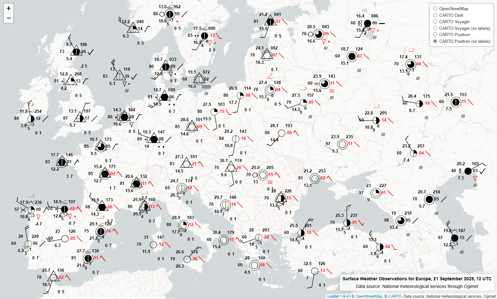
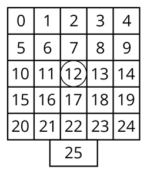

# station-model-symbology
Dynamically generated, vector-based station model symbols for depicting weather observations on the client-side, intended for web maps. Compliant with [WMO-No. 306 "Manual on Codes", Volume I-1, Attachment IV](https://library.wmo.int/records/item/35713-manual-on-codes-volume-i-1-international-codes). 

*Disclaimer: The module is a work in progress, under development. Documentation is not final and might not be fully up-to-date. While striving to be covering all rules and supporting all options defined by the WMO document, there might be some elements or features that are not fully implemented yet.*



## Demo
Below you can find links to three example web maps, which employ the module to dynamically generate symbology from surface weather observations stored as an attribute within GeoJSON. Data attribution is included with the respective examples.
- Europe (21 Sep 2025, 12 UTC): [./examples/example_EU_20250921_12UTC.html](https://balladaniel.github.io/station-model-symbology/examples/example_EU_20250921_12UTC.html)
- Hungary (6 Sep 2025, 06 UTC): [./examples/example_HU_20250906_06UTC.html](https://balladaniel.github.io/station-model-symbology/examples/example_HU_20250906_06UTC.html)
- Hungary (17 Dec 2025, 14 UTC): [./examples/example_HU_20251217_14UTC.html](https://balladaniel.github.io/station-model-symbology/examples/example_HU_20251217_14UTC.html)

## Installation and Usage example for Leaflet
1. Have the following file structure in a common folder root:
- `station-model-symbology-Leaflet-UMD.js` - module bundled with an easy-to-use wrapper. In this case, UMD version for Leaflet.
- `pymetdecoder.zip` - module [pymetdecoder](https://github.com/antarctica/pymetdecoder/) as-is, as a .zip archive.
- `symbols` folder - containing the weather symbols, in the same folder structure as in [WorldWeatherSymbols](https://github.com/OGCMetOceanDWG/WorldWeatherSymbols/).

2. Include the bundled version that contains the wrapper for your preferred web mapping library: in this case, Leaflet.
``` html
<script src="./station-model-symbology-Leaflet-UMD.js" crossorigin=""></script>
```

3. In your script, provide a parsed GeoJSON as "data", like you would with an ordinary L.geoJSON layer. In options, define the attribute `field`, which contains encoded SYNOP strings for features:
``` javascript
const layer = L.stationModels(data, {
    field: "synop", // required
    scaling: {
        stationModel: 1,
        font: 1
    },
    temperature: "raw",
    dewPoint: "raw",
    polyChromatic: true,
    highCloudsInRed: true,
    elementsToOmit: []
}).addTo(map);
```

### Required options
- `field <string>`: target attribute field name containing the encoded SYNOP string.

### Additional options
- `scaling <object>`: global options for fine-tuning symbology scaling. These affect all symbols. Should be adjusted based on subjective needs based on feature density, map scale, map extent and intended level of detail to be plotted.
    - `stationModel <number>`: scaling for the final station model symbols. (default: 1)
    - `font <number>`: font scaling within the station model symbols. (default: 1)
- `temperature <string>`: ['raw'|'rounded'] plotting method for the temperature value TTT: "raw" plots tenths, "rounded" rounds value to the nearest degree. (default: 'raw') 
- `dewPoint <string>`: ['raw'|'rounded'] plotting method for the dew-point temperature value T<sub>d</sub>T<sub>d</sub>T<sub>d</sub>: "raw" plots tenths, "rounded" rounds value to the nearest degree. (default: 'raw') 
- `polyChromatic <boolean>`: if true, the polychromatic plotting method is used. This currently means, that the past weather reported from a manned station (W<sub>1</sub>W<sub>2</sub>) is plotted red, and amount (PPP) and characteristic of pressure tendency (a) will be plotted red, if pressure is decreasing (a >= 5). Moreover, in this case, the amount of pressure tendency (PPP) omits the minus sign. (default: true) *Note: This is an experimental option, can be refined/omitted later.*
- `highCloudsInRed <boolean>`: if true, C<sub>H</sub> symbol for high-altitude clouds is plotted in red. WMO-No. 306 optionally permits this. (default: true)
- `elementsToOmit <array<integer>>`: an array of element cell numbers to omit from the final symbol, regardless of data availability. Cell 12 (central station circle / cloud cover / wind shaft / manner of station) can not be hidden. For the cell numbers, refer to the illustration below and page A-441 of WMO-No. 306. Example: [6, 10, 11] will hide temperature value (TTT), horizontal visibility code figure (VV) and present weather symbol (ww/w<sub>a</sub>w<sub>a</sub>). (default: [])



## Components
Source code is structured as follows:
- `main_worker.js` - Code to be run in a Web Worker. Runs [Pyodide](https://github.com/pyodide/pyodide) and module pymetdecoder to decode the SYNOP reports. Requires `pymetdecoder.zip`.
- `main.js` - Main code logic for building station model symbols. Requires `main_worker.js`.
- `wrapper_Leaflet.js` - An example for a wrapper, written for Leaflet. Extends L.geoJSON. Tested with Leaflet v1.9.4. (In the future, creating wrappers for other web mapping libraries is planned.)

Since the main module receives the encoded SYNOP data and outputs an assembled, final SVG symbol for a SYNOP message, the module itself (`main.js` + `main_worker.js`) can be implemented in any software architecture that expects SVG symbols. The module was developed with the intention of using the symbols on Leaflet- and OpenLayers-based web maps. The bundle file is compiled with [Rollup](https://github.com/rollup/rollup), targeting the given wrapper as the entry point, resulting in a single file ready to be used with the given web mapping library. Alternatively, by changing the input of the Rollup config from the wrapper to `main.js`, you can have single file for the module itself.